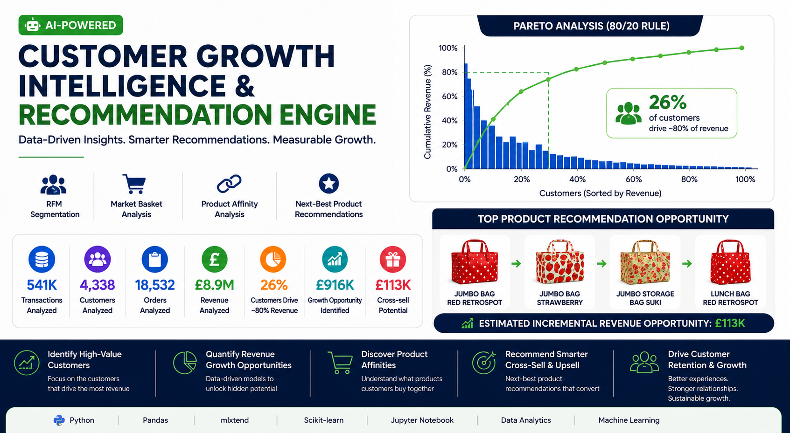
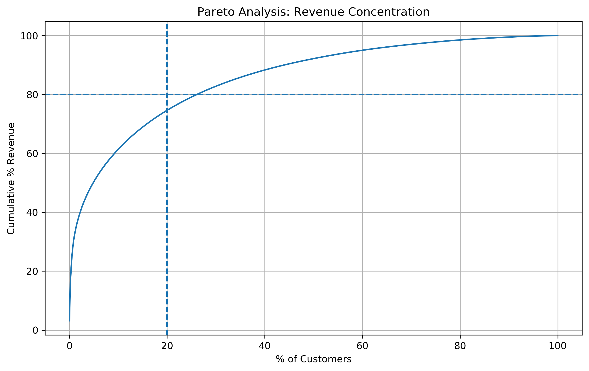
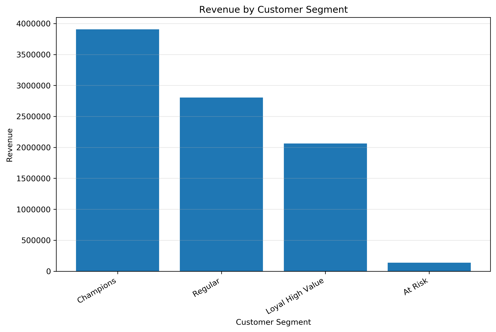
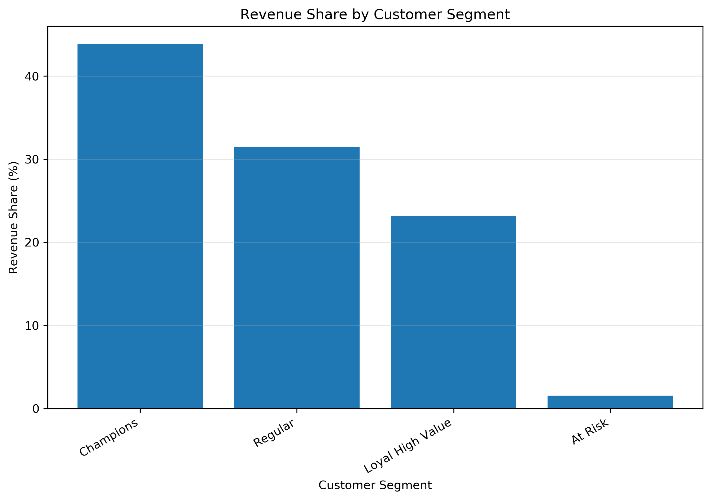
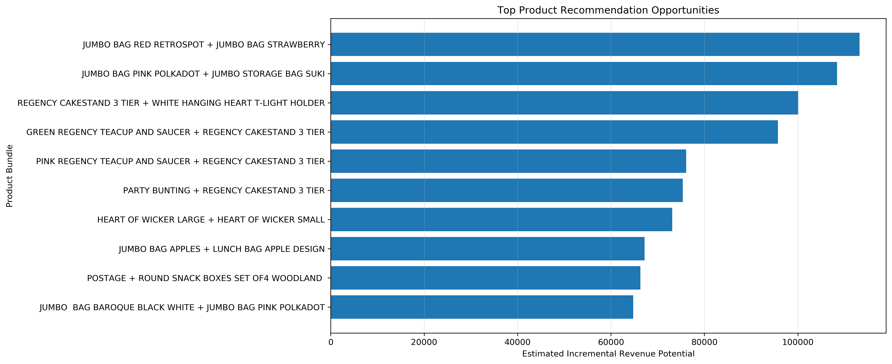

# Customer Growth Intelligence & Recommendation Engine



An end-to-end customer analytics and AI-powered recommendation engine built using Python to identify high-value customers, quantify revenue growth opportunities, and generate next-best product recommendations using customer segmentation, product affinity, and market basket analysis.

---

## Dataset

This project uses the **Online Retail Dataset** from the UCI Machine Learning Repository.

https://archive.ics.uci.edu/ml/datasets/online+retail

---

## Business Impact

| Metric | Value |
|--------|------:|
| Retail Transactions Analyzed | **541,909** |
| Customers Analyzed | **4,338** |
| Orders Analyzed | **18,532** |
| Revenue Analyzed | **£8.9M** |
| Customers Driving ~80% of Revenue | **26%** |
| Estimated Revenue Opportunity from Customer Segment Migration | **~£916K** |
| Top Product Bundle Revenue Opportunity | **~£113K** |

---

## Business Problem

Retailers generate millions of transactions but often struggle to answer questions such as:

- Which customers generate the highest business value?
- Where are the largest revenue growth opportunities?
- Which products should be recommended together?
- Which customer segments should marketing prioritize?
- How can analytics support personalized recommendations?

This project transforms raw transaction data into actionable business insights that support customer retention, cross-selling, and revenue growth.

---

## Analytics Workflow

```text
Transaction Data
        ↓
Data Cleaning & Feature Engineering
        ↓
Pareto Analysis (80/20 Revenue Rule)
        ↓
RFM Customer Segmentation
        ↓
Revenue Growth Opportunity Modeling
        ↓
Product Affinity & Market Basket Analysis
        ↓
AI Recommendation Engine
        ↓
Business Recommendations & Revenue Impact
```

---

## Key Insights

- **26% of customers generated approximately 80% of total revenue**, confirming a strong Pareto effect.
- **Champion customers represented only 348 customers while contributing nearly 44% of total revenue.**
- A **10% migration of Regular customers into higher-value customer segments** could generate approximately **£916K in incremental revenue.**
- Market Basket Analysis identified strong purchasing relationships that support targeted cross-selling and bundle promotions.
- Built an AI-powered recommendation engine that recommends the top three complementary products based on historical purchasing behavior and estimated revenue opportunity.

---

## Recommendation Engine Example

| Purchased Product | Recommendation 1 | Recommendation 2 | Recommendation 3 | Estimated Incremental Revenue |
|------------------|------------------|------------------|------------------|------------------------------:|
| JUMBO BAG RED RETROSPOT | JUMBO BAG STRAWBERRY | JUMBO STORAGE BAG SUKI | LUNCH BAG RED RETROSPOT | **£113K** |

---

# Visualizations

## Pareto Revenue Analysis



---

## Revenue by Customer Segment



---

## Revenue Share by Customer Segment



---

## Top Product Recommendation Opportunities



---

## Technologies

- Python
- Pandas
- NumPy
- Matplotlib
- mlxtend
- Scikit-learn
- Jupyter Notebook

---

## Future Enhancements

- LLM-powered recommendation assistant
- Real-time recommendation API
- Hybrid recommendation engine combining collaborative filtering and market basket analysis
- Interactive Streamlit dashboard
- Personalized customer recommendation scoring

---

## Author

**Paromita Das**

Senior Analytics Leader | Machine Learning | AI | Customer Analytics | Product Strategy

**LinkedIn:**  
https://www.linkedin.com/in/paromitadas

**GitHub:**  
https://github.com/romy0806
