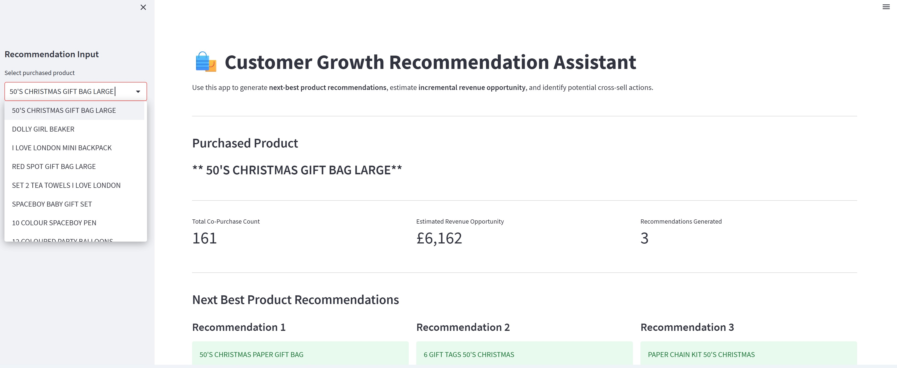
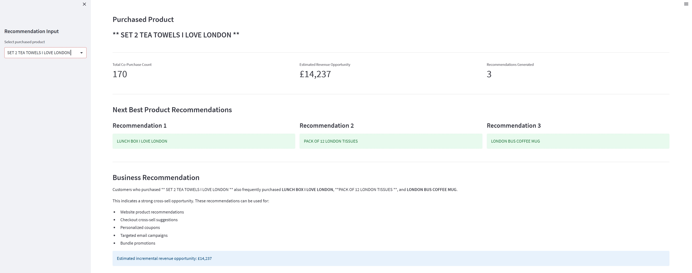
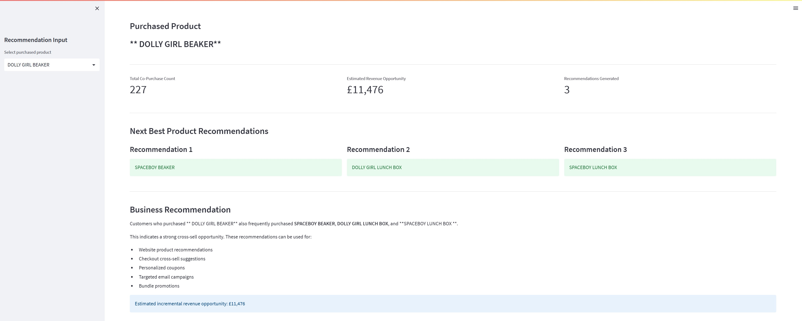

# Customer Growth Intelligence & Recommendation Engine


> Interactive customer analytics application powered by Python and Streamlit that transforms transaction data into revenue opportunities and next-best product recommendations.

## Project Overview

An end-to-end customer growth analytics platform built using **Python, Market Basket Analysis, RFM Segmentation, and Streamlit** to identify high-value customers, quantify revenue growth opportunities, and deliver interactive next-best product recommendations through a business-friendly application.

The project demonstrates how transaction data can be transformed into actionable business insights that support customer retention, cross-selling, merchandising decisions, and revenue growth.

---

## Dataset

This project uses the **Online Retail Dataset** from the UCI Machine Learning Repository.

https://archive.ics.uci.edu/ml/datasets/online+retail

---

## Business Impact

| Metric | Value |
|--------|------:|
| Retail Transactions Analyzed | **541,909** |
| Customers Analyzed | **4,338** |
| Orders Analyzed | **18,532** |
| Revenue Analyzed | **£8.9M** |
| Customers Driving ~80% of Revenue | **26%** |
| Estimated Revenue Opportunity from Customer Segment Migration | **~£916K** |
| Top Product Bundle Revenue Opportunity | **~£113K** |

---
## Key Features
- Interactive Streamlit recommendation assistant
- RFM customer segmentation
- Pareto (80/20) revenue analysis
- Market Basket Analysis using association rules
- Next-best product recommendation engine
- Revenue opportunity estimation
- Business-friendly recommendation app interface
---

## Business Problem
Retailers generate millions of transactions but often struggle to answer questions such as:
- Which customers generate the highest business value?
- Where are the largest revenue growth opportunities?
- Which products should be recommended together?
- Which customer segments should marketing prioritize?
- How can analytics support personalized recommendations?

This project transforms raw transaction data into actionable business insights that support customer retention, cross-selling, and revenue growth.

---

## Analytics Workflow

```text
Transaction Data
        ↓
Data Cleaning & Feature Engineering
        ↓
Pareto Analysis (80/20 Revenue Rule)
        ↓
RFM Customer Segmentation
        ↓
Revenue Growth Opportunity Modeling
        ↓
Product Affinity & Market Basket Analysis
        ↓
AI Recommendation Engine
        ↓
Business Recommendations & Revenue Impact
```

---

## Key Insights

- **26% of customers generated approximately 80% of total revenue**, confirming a strong Pareto effect.
- **Champion customers represented only 348 customers while contributing nearly 44% of total revenue.**
- A **10% migration of Regular customers into higher-value customer segments** could generate approximately **£916K in incremental revenue.**
- Market Basket Analysis identified strong purchasing relationships that support targeted cross-selling and bundle promotions.
- Built an AI-powered recommendation engine that recommends the top three complementary products based on historical purchasing behavior and estimated revenue opportunity.

---

## Recommendation Engine Example

| Purchased Product | Recommendation 1 | Recommendation 2 | Recommendation 3 | Estimated Incremental Revenue |
|------------------|------------------|------------------|------------------|------------------------------:|
| JUMBO BAG RED RETROSPOT | JUMBO BAG STRAWBERRY | JUMBO STORAGE BAG SUKI | LUNCH BAG RED RETROSPOT | **£113K** |

---

# Visualizations

## Pareto Revenue Analysis


---

## Revenue by Customer Segment


---

## Revenue Share by Customer Segment


---

## Top Product Recommendation Opportunities


---

# Interactive Recommendation Assistant

Built a **Streamlit app** that makes the recommendation engine easy for business users to explore, test recommendations, and estimate potential revenue gains.

---

## Product Search

Business users can quickly search and select products from the catalog using an interactive searchable interface.



---

## Recommendation Example – London Collection

For a selected product, the assistant generates complementary product recommendations, summarizes co-purchase behavior, and estimates the associated revenue opportunity.



---

## Recommendation Example – Dolly Girl Collection

Recommendations automatically update based on the selected product, demonstrating how the recommendation engine adapts across different product categories and purchasing behaviors.



---

## Current Business Applications

The recommendation engine currently supports:

- Website product recommendations
- Checkout cross-sell suggestions
- Product bundle recommendations
- Revenue opportunity estimation
- Customer cross-sell analysis


---

## Technologies

- Python
- Streamlit
- Pandas
- NumPy
- Matplotlib
- mlxtend
- Scikit-learn
- Jupyter Notebook

---

## Run the Application

1. Clone this repository.

```bash
git clone https://github.com/romy0806/customer-growth-recommendation-engine.git
```

2. Navigate to the project directory.

```bash
cd customer-growth-recommendation-engine
```

3. Install the required packages.

```bash
pip install -r requirements.txt
```

4. Launch the interactive Streamlit application.

```bash
streamlit run app.py
```

5. Open the local URL displayed in your terminal (typically `http://localhost:8501`) to interact with the recommendation assistant.

> **Note:** The repository includes a pre-generated `recommendation_bundle.csv` file so the Streamlit application can be launched immediately. To regenerate the recommendation dataset from the raw transaction data, run the Jupyter notebook (`Customer_Growth_Recommendation_Engine.ipynb`) before launching the application.
---

## Future Enhancements

The next phase of this project focuses on transforming the recommendation engine into an AI-powered business assistant capable of supporting real-time decision making.

Planned enhancements include:

- AI-powered Recommendation Copilot using Large Language Models (LLMs)
- Natural language business queries (e.g., "What products should we recommend to customers purchasing coffee mugs?")
- AI-generated marketing campaign recommendations
- Personalized promotional messaging
- Customer-specific recommendation generation
- Automated coupon and offer suggestions
- Cloud deployment using Streamlit Community Cloud
- REST APIs for e-commerce and CRM integration

---

## Author

**Paromita Das**

Senior Analytics Leader | Machine Learning | AI | Customer Analytics | Product Strategy

**LinkedIn:**  
https://www.linkedin.com/in/paromitadas

**GitHub:**  
https://github.com/romy0806
